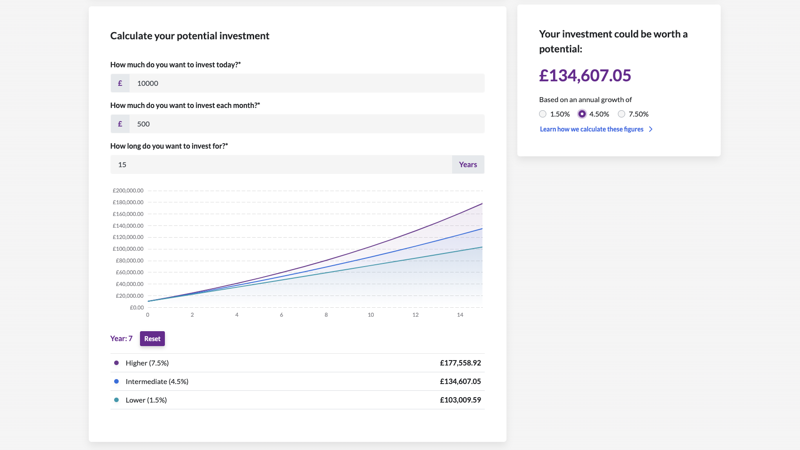

# LBG Assessment Day - Additional Resources

ScrumAlliance – [Everything you Need to Know About Acceptance Criteria](https://resources.scrumalliance.org/Article/need-know-acceptance-criteria)

Agile For Growth – [7 Tips For Writing Acceptance Criteria](https://agileforgrowth.com/blog/acceptance-criteria-checklist/)

The Product Manager – [How to Write Excellent Acceptance Criteria](https://theproductmanager.com/general/how-to-write-excellent-acceptance-criteria-with-examples/) 

Toucan - [Financial Data Visualisation: Everything You Need to Know](https://www.toucantoco.com/en/blog/financial-data-visualization-everything-you-need-to-know)

Example of an account planning visualisation tool:

